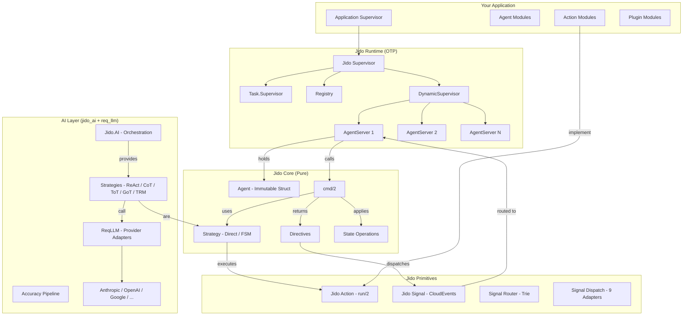
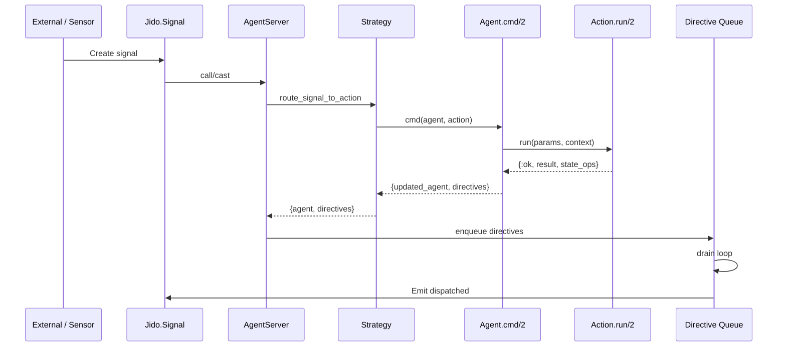

%{
  title: "Architecture Overview",
  order: 40,
  purpose: "Provide a 10,000-foot view of the Jido framework architecture — core components, boundaries, OTP integration, and where AI plugs in",
  audience: :intermediate,
  content_type: :explanation,
  learning_outcomes: [
    "Map Jido's layered architecture from pure primitives to OTP runtime",
    "Identify core components (Agent, Action, Signal, Directive, AgentServer) and their boundaries",
    "Understand where OTP supervision, GenServer, and Registry fit",
    "Understand how jido_ai, req_llm, and strategies extend the core",
    "Distinguish what lives inside Jido's responsibility versus what developers own"
  ],
  repos: ["jido", "jido_action", "jido_signal", "jido_ai", "req_llm"],
  source_modules: [
    "Jido",
    "Jido.Agent",
    "Jido.AgentServer",
    "Jido.Agent.Directive",
    "Jido.Agent.Strategy",
    "Jido.Plugin",
    "Jido.Sensor",
    "Jido.Signal",
    "Jido.Signal.Router",
    "Jido.Signal.Bus",
    "Jido.Signal.Dispatch",
    "Jido.Action",
    "Jido.Exec",
    "Jido.Thread",
    "Jido.Memory",
    "Jido.Persist",
    "Jido.Discovery",
    "Jido.Observe",
    "Jido.AI",
    "Jido.AI.Strategies.ReAct"
  ],
  source_files: [
    "lib/jido.ex",
    "lib/jido/agent.ex",
    "lib/jido/agent_server.ex",
    "lib/jido/agent/directive.ex",
    "lib/jido/agent/strategy.ex",
    "lib/jido/plugin.ex",
    "lib/jido/sensor.ex",
    "lib/jido/signal.ex",
    "lib/jido/thread.ex",
    "lib/jido/memory.ex",
    "lib/jido/persist.ex",
    "lib/jido/discovery.ex",
    "lib/jido/observe.ex"
  ],
  status: :outline,
  priority: :high,
  prerequisites: ["docs/key-concepts"],
  related: [
    "docs/agents",
    "docs/actions",
    "docs/signals",
    "docs/directives",
    "docs/plugins",
    "ecosystem/package-matrix",
    "docs/architecture-decision-guides",
    "build/first-agent"
  ],
  ecosystem_packages: ["jido", "jido_action", "jido_signal", "jido_ai", "req_llm"],
  destination_route: "/docs/architecture-overview",
  destination_collection: :pages,
  tags: [:docs, :architecture, :foundation, :overview]
}
---
## Content Brief

A "Jido at 10,000 feet" architecture overview — the page developers read after grasping key concepts but before diving into any single component. It should answer: *what are the parts, how do they fit together, what does Jido own, and what do I own?*

---

### 1. The Core Metaphor: Think, Then Act

Jido separates **pure decision logic** from **effectful execution**. This is the single most important architectural idea:

- **Agent** (think) — An immutable data structure. The `cmd/2` function is pure: same inputs always produce the same `{updated_agent, directives}` output. No processes, no side effects.
- **AgentServer** (act) — A GenServer wrapper that holds an Agent in process state, routes incoming Signals to `cmd/2`, and executes the Directives that come back.

This separation means agents are testable without processes, deterministic, and serializable. The runtime adds concurrency, supervision, and effect execution on top.

---

### 2. Package Boundaries (What Lives Where)

The framework is split across five Hex packages at Tier 1:

| Package | Role | Key Modules |
|---------|------|-------------|
| **jido_action** | Composable command pattern — every capability is an Action | `Jido.Action`, `Jido.Exec`, `Jido.Instruction`, `Jido.Plan`, `Jido.Action.Tool` |
| **jido_signal** | CloudEvents-based messaging envelope and delivery infrastructure | `Jido.Signal`, `Jido.Signal.Router`, `Jido.Signal.Bus`, `Jido.Signal.Dispatch`, `Jido.Signal.Journal` |
| **jido** | Core agent framework — Agent, AgentServer, Plugins, Strategies, Persistence | `Jido.Agent`, `Jido.AgentServer`, `Jido.Plugin`, `Jido.Sensor`, `Jido.Thread`, `Jido.Memory`, `Jido.Persist` |
| **jido_ai** | LLM orchestration — reasoning strategies, accuracy pipeline, tool management | `Jido.AI`, `Jido.AI.Strategies.ReAct`, `Jido.AI.Strategies.CoT`, `Jido.AI.Executor` |
| **req_llm** | Universal LLM client — provider adapters, streaming, structured output | `ReqLLM`, `ReqLLM.Streaming`, provider modules |

Dependency flow: `jido_action` ← `jido_signal` ← `jido` ← `jido_ai` ← `req_llm`

---

### 3. Core Components and Their Boundaries

#### Agent (`Jido.Agent`)
- Immutable struct with schema-validated state (NimbleOptions or Zoi)
- Single entry point: `cmd/2` — accepts Action modules, `{Action, params}` tuples, `%Instruction{}` structs, or lists
- Returns `{updated_agent, directives}` — agent is always fully updated; directives are strictly outbound
- Lifecycle hooks: `on_before_cmd/2`, `on_after_cmd/3`
- No process, no side effects — purely functional

#### Action (`Jido.Action`)
- The unit of work — every capability is an Action implementing `run/2`
- Schema-validated params and outputs
- Automatically convertible to LLM tool definitions via `Jido.Action.Tool`
- Composable via `Jido.Instruction` and `Jido.Plan` (DAG-based workflow planning)
- Executed by `Jido.Exec` engine with retries, timeouts, compensation

#### Signal (`Jido.Signal`)
- CloudEvents v1.0.2 compliant message envelope — the universal message format
- Everything flows as a Signal: events, commands, agent messages, state changes
- Routed by `Jido.Signal.Router` (trie-based, O(k) matching, wildcards)
- Dispatched by `Jido.Signal.Dispatch` (9 built-in adapters: PID, PubSub, HTTP, Webhook, etc.)
- Tracked by `Jido.Signal.Journal` (causality graph, conversation threading)

#### Directive (`Jido.Agent.Directive`)
- Typed effect descriptions emitted by `cmd/2` — bare structs, not tuples
- Built-in: `Emit`, `Error`, `Spawn`, `SpawnAgent`, `StopChild`, `Schedule`, `Stop`, `Cron`, `CronCancel`
- Directives **never modify agent state** — that's handled by the returned agent
- The runtime (AgentServer) interprets and executes them via `DirectiveExec` protocol
- Extensible: external packages define custom directive structs without modifying core

#### State Operations (`Jido.Agent.StateOp`)
- Internal state transitions handled by the strategy layer during `cmd/2`
- `SetState`, `ReplaceState`, `DeleteKeys`, `SetPath`, `DeletePath`
- Unlike directives, state ops never leave the strategy — they're applied immediately

#### Strategy (`Jido.Agent.Strategy`)
- Pluggable execution strategy controlling how `cmd/2` processes actions
- Built-in: **Direct** (immediate sequential), **FSM** (finite state machine with transition guards)
- `jido_ai` adds AI strategies: **ReAct**, **CoT**, **ToT**, **GoT**, **TRM**, **Adaptive**
- Strategies own signal routing rules (`signal_routes/1`) and state initialization

#### Plugin (`Jido.Plugin`)
- Composable capability module attached to agents
- Encapsulates: actions, schema-validated state (under `state_key`), config, signal routing, lifecycle hooks, child processes, cron schedules
- Lifecycle: compile-time declaration → `mount/2` at `Agent.new/1` → `child_spec/1` at AgentServer init → `handle_signal/2` at runtime

---

### 4. Where OTP Fits

**Supervision tree** (what `use Jido, otp_app: :my_app` creates):

```
MyApp.Jido (Supervisor)
├── Task.Supervisor        — bounded async work (max_tasks configurable)
├── Registry               — agent lookup by ID (unique keys)
├── DynamicSupervisor      — agent processes (one_for_one, auto-restart)
└── WorkerPool children    — optional pre-warmed Poolboy pools
```

**AgentServer** — each agent is a GenServer under the DynamicSupervisor:
- Registered in the instance-scoped Registry by agent ID
- Owns the signal processing loop: Signal → route → `cmd/2` → drain directive queue
- Internal directive queue with non-blocking drain loop
- Parent-child hierarchy with monitors and configurable death policies

**Key OTP patterns used:**
- `DynamicSupervisor` for elastic agent lifecycle
- `Registry` for O(1) agent lookup by ID
- `Task.Supervisor` for bounded async execution
- `GenServer` for agent process state and message handling
- Process monitors for parent-child hierarchy tracking
- `:persistent_term` for component discovery catalog

---

### 5. Where LLM Providers and Tools Plug In

```
Your Code
  │
  ▼
Jido.AI (orchestration)
  ├── Model aliases (:fast, :capable, :reasoning)
  ├── Reasoning strategies (ReAct, CoT, ToT, GoT, TRM, Adaptive)
  ├── Accuracy pipeline (verification, reflection, self-consistency)
  ├── Tool management (register/unregister at runtime)
  │
  ▼
ReqLLM (transport)
  ├── Provider adapters (Anthropic, OpenAI, Google, Groq, xAI, OpenRouter, ...)
  ├── Streaming (HTTP/2, SSE, early cancellation)
  ├── Structured output (schema validation)
  ├── Tool/function calling (JSON Schema from Action schemas)
  └── Usage tracking and billing
```

**How it connects:**
- `Jido.AI` strategies are `Jido.Agent.Strategy` implementations — they plug into `cmd/2` like any other strategy
- Actions double as LLM tools via `Jido.Action.Tool` — automatic conversion to OpenAI function-calling format
- `Jido.AI` sends signals to `AgentServer.call/cast` which routes them through the strategy
- Tool registration/unregistration is signal-driven: `react.register_tool` / `react.unregister_tool`
- Model selection uses aliases resolved at call time via `Jido.AI.resolve_model/1`

---

### 6. Where State Lives

| State Type | Location | Mechanism |
|-----------|----------|-----------|
| Agent state (domain data) | `agent.state` map | Schema-validated, updated by `cmd/2` return |
| Strategy state | `agent.strategy_state` | Managed by strategy's `init/2` and state ops |
| Plugin state | `agent.state[plugin.state_key]` | Initialized by `mount/2`, updated via state ops |
| Process state | `AgentServer` GenServer state | Holds agent struct, directive queue, children map, parent ref |
| Thread (interaction log) | `Jido.Thread` | Append-only log of entries (conversation/workflow history) |
| Memory (cognitive) | `Jido.Memory` | Named spaces (world, tasks, custom) — mutable cognitive substrate |
| Persistence | `Jido.Persist` / `Jido.Storage` | Hibernate/thaw lifecycle, pluggable storage backends (ETS default) |

---

### 7. Inside vs Outside Jido's Responsibility

| Jido Owns | You Own |
|-----------|---------|
| Agent struct lifecycle and `cmd/2` contract | Agent module definitions and state schemas |
| Action execution engine (retries, timeouts, compensation) | Action `run/2` implementations (your business logic) |
| Signal envelope format and routing infrastructure | Signal types and dispatch configuration |
| Directive execution protocol and built-in executors | Custom directive types (if any) |
| OTP supervision tree structure | Application supervision and deployment |
| Plugin mount/lifecycle framework | Plugin implementations and compositions |
| AgentServer process management | Which agents to start, when, and with what config |
| Persistence hibernate/thaw protocol | Storage adapter choice (ETS, custom) |
| Telemetry event emission | Telemetry handlers and dashboards |
| LLM strategy framework (jido_ai) | Model selection, prompt design, tool implementations |
| Provider transport (req_llm) | API keys, rate limit policies, cost budgets |

---

### 8. Suggested Mermaid Diagram

The final page should include a layered architecture diagram. Suggested structure:



A second diagram should show the **signal flow** through the system:



---

### Validation Criteria

- Every component named matches an actual module in the source code
- Dependency flow between packages is accurate per `mix.exs` deps
- OTP supervision tree matches `Jido.init/1` implementation
- Signal flow matches `AgentServer` processing pipeline
- No speculative features — only what's implemented in current codebase
- Mermaid diagrams render correctly and match the narrative
- Links forward to deep-dive pages for each component (agents, actions, signals, directives, plugins)
