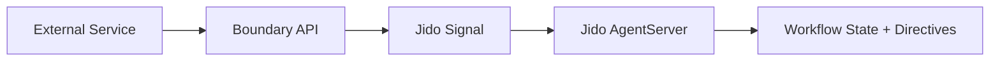

%{
  title: "Mixed-Stack Integration",
  category: :build,
  description: "Integrate Jido agents with Python, Node.js, and other language ecosystems.",
  doc_type: :guide,
  audience: :intermediate,
  draft: false,
  order: 30
}
---
Mixed-stack integration works when Jido owns orchestration and external services keep domain delivery.
Use this guide to define stable boundaries first, then scale integrations without rewriting every service.

## Where this guide fits

Use this after [Reference Architectures](/build/reference-architectures) when you already know your runtime topology and need language-neutral contracts.
If you are still selecting first milestones, start with [Quickstarts by Persona](/build/quickstarts-by-persona).

## Prerequisites

- A running Jido runtime boundary in your Elixir app (see [Build with Jido](/build)).
- One external service (Python, Node.js, JVM, or .NET) that can call HTTP endpoints or publish events.
- Team agreement on one pilot workflow with explicit success and rollback criteria.
- Baseline guardrails from [Security and Governance](/docs/reference/security-and-governance).

## Boundary pattern A: API-first handoff

Use API-first when the external product service already owns synchronous request/response behavior.
The external service calls a bounded endpoint, and the endpoint emits a typed signal into Jido runtime.



Contract handoff example:

```elixir
alias Jido.Signal

payload = %{request_id: "req-42", action: "triage_ticket", priority: "high"}

signal = Signal.new!("external.workflow.requested", payload, source: "/api/workflows")
Jido.AgentServer.cast(AgentJido.ContentOps.OrchestratorServer, signal)
```

## Boundary pattern B: Event-first handoff

Use event-first when upstream systems already publish durable events and can tolerate async completion.
A translator process normalizes event payloads and forwards only schema-checked fields into Jido signals.

```elixir
signal =
  Jido.Signal.new!(
    "contentops.tick.weekly",
    %{trigger: "integration_pilot", ticket_batch: 10},
    source: "/cli/agentjido.signal"
  )

Jido.AgentServer.call(AgentJido.ContentOps.OrchestratorServer, signal, 30_000)
```

This call pattern is the same shape used by `mix agentjido.signal`, giving you a direct operational bridge between integration contracts and runtime verification.

## Rollout and rollback checklist

1. Start with one high-friction workflow and one owning team.
2. Version the boundary payload and reject unknown fields at ingress.
3. Define one fallback path in the external service if Jido boundary checks fail.
4. Add runtime checks from [Production Readiness Checklist](/docs/reference/production-readiness-checklist) before expanding scope.

## Proof surface in this repository

The application supervises a dedicated orchestrator server in `AgentJido.Application`.
That gives mixed-stack systems a stable runtime boundary with explicit ownership.

```elixir
{Jido.AgentServer,
 id: AgentJido.ContentOps.OrchestratorServer,
 agent: AgentJido.ContentOps.OrchestratorAgent,
 jido: AgentJido.Jido,
 name: AgentJido.ContentOps.OrchestratorServer}
```

Verification command:

```bash
mix agentjido.signal contentops.tick.weekly --agent contentops --data '{"trigger":"integration_pilot"}'
```

Expected output includes:

```
Signal processed
```

## Next links

- Training: [LiveView + Jido Integration Patterns](/training/liveview-integration)
- Docs: [Guides](/docs/getting-started/guides)
- Related build page: [Product Feature Blueprints](/build/product-feature-blueprints)
- Context page: [BEAM for AI Builders](/features/beam-for-ai-builders)

## Get Building

Choose one boundary contract, run one pilot workflow, and keep the orchestration boundary narrow until reliability checks pass.
Then expand with [Product Feature Blueprints](/build/product-feature-blueprints) for reusable delivery patterns.
