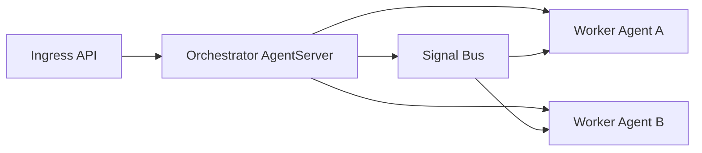

%{
  title: "Reference Architectures",
  category: :build,
  description: "Production-proven patterns for common agent system designs.",
  doc_type: :reference,
  audience: :intermediate,
  draft: false,
  order: 20
}
---
Reference architectures let you choose runtime boundaries before implementation details multiply.
Use this page to pick a topology, package set, and rollout checklist that match your constraints.

## Pattern 1: Single-service supervised runtime

Best for one team shipping one bounded workflow inside an existing Elixir service.

- Required packages: `jido`, `jido_action`
- Optional packages: `jido_signal`, `jido_live_dashboard`
- First proof route: [Counter Agent example](/examples/counter-agent)
- Validation route: [Agent Fundamentals on the BEAM](/training/agent-fundamentals)

Tradeoff: lowest integration overhead, but domain boundaries can blur as workflows expand.

## Pattern 2: Orchestration hub with specialized workers

Best for systems that need explicit coordination across multiple agents and work types.

- Required packages: `jido`, `jido_action`, `jido_signal`
- Optional packages: `jido_messaging`, `jido_ai`
- First proof route: [Demand Tracker Agent example](/examples/demand-tracker-agent)
- Validation route: [Signals and Routing](/training/signals-routing)

Tradeoff: stronger isolation and routing clarity, with additional coordination complexity.



## Pattern 3: Mixed-stack control plane on the BEAM

Best for teams where product surfaces are not Elixir-native but reliability and orchestration need a stable runtime boundary.

- Required packages: `jido`, `jido_signal`
- Optional packages: `req_llm`, `jido_ai`, `agent_jido`
- First proof route: [BEAM for AI Builders](/features/beam-for-ai-builders)
- Validation route: [LiveView + Jido Integration Patterns](/training/liveview-integration)

Tradeoff: clearer failure containment and control-plane behavior, with cross-language contract design work.

## Proof surface in this repository

The application boots an orchestrator under `Jido.AgentServer` supervision in `AgentJido.Application`.

```elixir
{Jido.AgentServer,
 id: AgentJido.ContentOps.OrchestratorServer,
 agent: AgentJido.ContentOps.OrchestratorAgent,
 jido: AgentJido.Jido,
 name: AgentJido.ContentOps.OrchestratorServer}
```

This provides an implementation reference for supervised runtime topology and explicit agent ownership.

## Selection checklist

1. Choose the smallest pattern that supports your near-term workflow complexity.
2. Map each critical workflow to one owning agent and one fallback path.
3. Confirm observability and recovery expectations with [Production Readiness Checklist](/docs/reference/production-readiness-checklist).
4. Review runtime and package rationale with [Architecture](/docs/reference/architecture).

## Get Building

After selecting a topology, execute a bounded build path from [Quickstarts by Persona](/build/quickstarts-by-persona) and validate the rollout with [Production Readiness: Supervision, Telemetry, and Failure Modes](/training/production-readiness).
