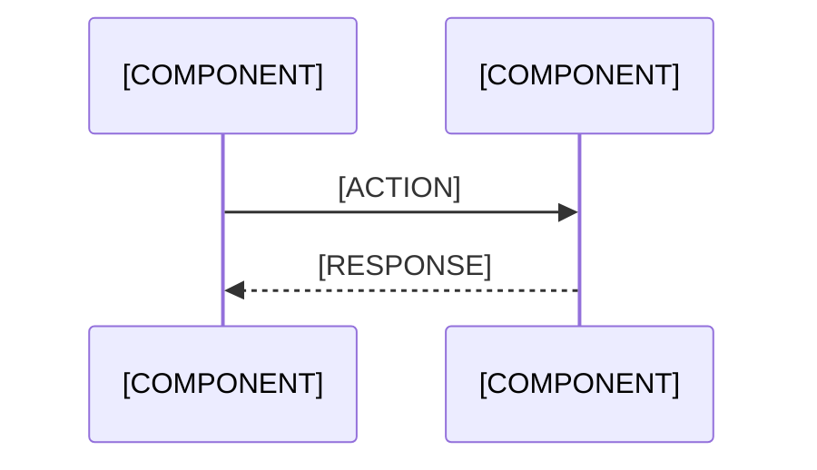

<!-- 
  TEMPLATE: Docs Concept Page
  Use for: /docs/core-concepts/* pages (e.g., /docs/core-concepts/signals)
  Tone: See specs/style-voice.md — code-first for docs, show implementation then explain.
  Rules: content-outline.md §5 (clear claim, architecture explanation, runnable proof,
         training cross-link, docs/reference cross-link, CTA).
-->

# [CONCEPT NAME]

## What Is [CONCEPT NAME]?

<!-- One paragraph definition. Be precise and technical — this is the docs section.
     Name the module(s) that implement this concept. -->

[ONE PARAGRAPH DEFINING THE CONCEPT. E.g., "A Signal in Jido is a typed message that agents use to communicate. Signals are defined as structs with validated schemas, routed through the runtime's signal bus, and processed by registered handlers. They are implemented in the `Jido.Signal` module."]

---

## Why It Matters

<!-- Practical motivation: What does this concept enable? Why would an engineer care?
     Connect it to a real problem. -->

[2-3 SENTENCES ON WHY THIS CONCEPT EXISTS AND WHAT PROBLEMS IT SOLVES. Be concrete — "Without typed signals, inter-agent messages are unvalidated maps that break silently at runtime" not "Signals are an important concept."]

---

## How It Works

<!-- Technical explanation with enough depth for implementation. Include a diagram
     showing the flow or relationships. -->

[3-5 PARAGRAPHS EXPLAINING THE MECHANICS. Cover: how to create one, how the runtime uses it, what happens at each stage.]

<!-- Diagram showing the concept in action: -->



---

## API Reference Summary

<!-- Key modules, functions, and types. This is a summary — link to full HexDocs
     for complete reference. Must match current module signatures (content-governance.md §10). -->

### Key Modules

| Module | Purpose |
|--------|---------|
| `[MODULE]` | [ONE-LINE DESCRIPTION] |
| `[MODULE]` | [ONE-LINE DESCRIPTION] |

### Key Functions

| Function | Description |
|----------|-------------|
| `[MODULE].[FUNCTION]/[ARITY]` | [WHAT IT DOES] |
| `[MODULE].[FUNCTION]/[ARITY]` | [WHAT IT DOES] |

### Key Types

```elixir
@type [TYPE_NAME] :: [TYPE_DEFINITION]
```

---

## Common Patterns

<!-- 2-3 usage patterns with code. These should cover the most frequent ways
     engineers will use this concept. Code must be runnable (style-voice.md). -->

### Pattern 1: [PATTERN NAME — e.g., "Basic Signal Definition"]

```elixir
[RUNNABLE CODE SHOWING THIS PATTERN]
```

[1-2 SENTENCES ON WHEN TO USE THIS PATTERN]

### Pattern 2: [PATTERN NAME — e.g., "Signal Routing with Filters"]

```elixir
[RUNNABLE CODE]
```

[WHEN TO USE]

### Pattern 3: [PATTERN NAME — e.g., "Error Handling in Signal Handlers"]

```elixir
[RUNNABLE CODE]
```

[WHEN TO USE]

---

## Gotchas and Edge Cases

<!-- Things that trip people up. Be specific — name the error or unexpected behavior. -->

- **[GOTCHA TITLE]:** [DESCRIPTION — what happens and how to avoid it]
- **[GOTCHA TITLE]:** [DESCRIPTION]
- **[GOTCHA TITLE]:** [DESCRIPTION]

---

## Related Concepts

<!-- Link to other concept pages that connect to this one. -->

- [RELATED CONCEPT](/docs/core-concepts/[SLUG]) — [One sentence on the relationship]
- [RELATED CONCEPT](/docs/core-concepts/[SLUG]) — [One sentence]
- [RELATED CONCEPT](/docs/core-concepts/[SLUG]) — [One sentence]

---

## Guides and Training

<!-- Cross-links required (content-outline.md §5). -->

- **Training:** [MODULE TITLE](/training/[SLUG]) — Learn [CONCEPT] step by step
- **Build guide:** [GUIDE TITLE](/build/[SLUG]) — Use [CONCEPT] in a real project
- **Full API docs:** [HexDocs](https://hexdocs.pm/[PACKAGE]/[MODULE].html)

---

## Get Building

<!-- CTA required (content-outline.md §5 rule 6). -->

[Try [CONCEPT] in a project](/build/getting-started) or [learn it step by step in training](/training/[SLUG]).

---

<!--
  ============================================================
  PUBLISHING CHECKLIST (content-governance.md §10)
  Remove this block before publishing.
  ============================================================

  Before publishing:
  [ ] Package references are real
  [ ] Code examples compile — real modules, functions, arities
  [ ] Links resolve — all routes exist
  [ ] Claims are bounded
  [ ] CTA is present and routed
  [ ] Voice check — technical reference tone
  [ ] Cross-link chain — forward (training/build) and backward (features/ecosystem)

  Docs-specific checks:
  [ ] API references match current module signatures
  [ ] Configuration keys are valid
  [ ] Types match current typespecs
-->
