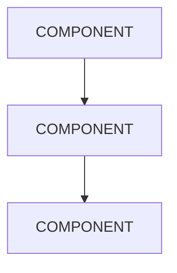

<!-- 
  TEMPLATE: Feature Page
  Use for: /features/* pages (e.g., /features/reliability-by-architecture)
  Tone: See specs/style-voice.md — staff engineer explaining to a peer.
  Rules: content-outline.md §5 (every page needs: clear claim, concrete architecture 
         explanation, one runnable proof, one training cross-link, one docs/reference 
         cross-link, CTA).
-->

# [FEATURE NAME]

<!-- Hero claim: One sentence that states what this feature gives the engineer.
     Be specific and bounded — no "unlock the power of." See style-voice.md §What We Do Not Sound Like. -->

[ONE-SENTENCE CLAIM — e.g., "Jido agents recover from failures automatically because supervision is built into the runtime, not bolted on after."]

---

## The Problem

<!-- What engineering problem does this solve? Frame it from the reader's experience.
     Name the pain concretely: "When your agent crashes mid-task..." not "Reliability is important." -->

[DESCRIBE THE ENGINEERING PROBLEM IN 2-4 SENTENCES. What goes wrong without this? What does the reader currently do to work around it?]

---

## How Jido Addresses This

<!-- Architecture explanation: How does Jido solve this at the architecture level?
     Show the structural reason, not just the feature label.
     Include a diagram placeholder below. -->

[EXPLAIN THE ARCHITECTURE IN 3-5 PARAGRAPHS. Reference specific Jido concepts (signals, supervision trees, process isolation, etc.). Be concrete: "Supervision restarts crashed agents" not "built-in resilience."]

<!-- DIAGRAM PLACEHOLDER: Add an architecture diagram here.
     Format: Mermaid block, SVG embed, or image reference.
     Show the structural relationship, not a marketing illustration. -->



---

## Proof: See It Work

<!-- Runnable code example — under 30 lines (style-voice.md §Code Example Conventions).
     Use realistic module/function names, not Foo/MyApp.
     Show the result or output, not just setup.
     Prefer jido ecosystem packages. -->

```elixir
# [BRIEF DESCRIPTION OF WHAT THIS EXAMPLE DEMONSTRATES]

[RUNNABLE CODE EXAMPLE — UNDER 30 LINES]
```

**Result:**

```
[EXPECTED OUTPUT]
```

---

## How This Differs

<!-- Comparison context: How does this differ from prototype-first approaches?
     Name competitors only when the comparison is specific and technical.
     Use "prototype-first frameworks" for general positioning.
     Never disparage — frame as fit-for-purpose differences (style-voice.md §Comparison and Competitor References). -->

[2-3 PARAGRAPHS COMPARING APPROACH. E.g., "Unlike prototype-first frameworks that add reliability as middleware, Jido's process model means each agent runs in its own supervised process from day one."]

---

## Learn More

<!-- Cross-links are required (content-outline.md §5, §6). Every feature page must link
     to at least one training module and one docs/reference page. -->

- **Training:** [TRAINING MODULE TITLE](/training/[MODULE-SLUG]) — [One sentence on what the reader will learn]
- **Docs:** [CONCEPT OR REFERENCE PAGE](/docs/[PATH]) — [One sentence on what they'll find]

---

## Get Building

<!-- CTA is required on every strategic page (content-outline.md §5 rule 6, content-governance.md §10 check 5).
     Link to a real destination. -->

Ready to [VERB RELATED TO THIS FEATURE]? [Start with the getting-started guide](/build/getting-started) or [explore the ecosystem](/ecosystem).

---

<!--
  ============================================================
  PUBLISHING CHECKLIST (content-governance.md §10)
  Remove this block before publishing — it's a writing aid only.
  ============================================================

  Before publishing:
  [ ] Package references are real — every package exists in priv/ecosystem/*.md with visibility: public
  [ ] Code examples compile — real modules, real functions, correct arities
  [ ] Links resolve — every cross-link points to a route in router.ex or published content
  [ ] Claims are bounded — no perf/scale/reliability claims without concrete reference
  [ ] CTA is present and routed to a real destination
  [ ] Voice check — reads like a staff engineer, not marketing copy
  [ ] Cross-link chain — links forward (training/docs/build) and backward (features/ecosystem)

  Features-specific checks:
  [ ] At least one code example demonstrating the capability
  [ ] Links to relevant ecosystem package
  [ ] Links to relevant training module
-->
