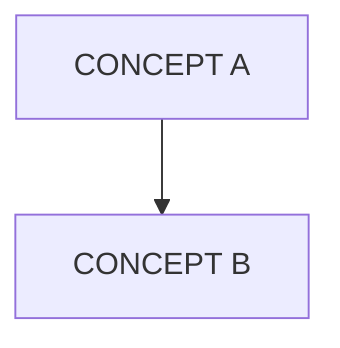

<!-- 
  TEMPLATE: Training Module
  Use for: /training/* pages (e.g., /training/agent-fundamentals)
  Tone: See specs/style-voice.md — pedagogical, build concepts incrementally,
        every code block should be runnable.
  Rules: content-outline.md §5 (clear claim, architecture explanation, runnable proof,
         training cross-link, docs/reference cross-link, CTA).
-->

# [MODULE TITLE]

## Learning Outcomes

<!-- What will the reader know or be able to do after completing this module?
     Use concrete, testable outcomes: "Define a Jido agent with typed signals"
     not "Understand agents." -->

After completing this module, you will be able to:

1. [CONCRETE OUTCOME — e.g., "Define a Jido agent with custom actions"]
2. [CONCRETE OUTCOME — e.g., "Route signals between agents using typed schemas"]
3. [CONCRETE OUTCOME — e.g., "Test agent behavior with ExUnit"]

---

## Prerequisites

<!-- What must the reader know or have installed before starting?
     Link to prior modules if this is part of a sequence. -->

- **Prior modules:** [MODULE TITLE](/training/[SLUG]) (or "None — this is a starting point")
- **Packages:** [PACKAGE_NAME] `~> [VERSION]`
- **Knowledge:** [WHAT THEY SHOULD ALREADY KNOW — e.g., "Basic Elixir: pattern matching, modules, GenServer concepts"]

---

## [CONCEPT NAME]

<!-- Introduce the concept before showing code. Build incrementally — start with the
     simplest version and add complexity. style-voice.md: "Build concepts incrementally." -->

### What Is [CONCEPT]?

[1-2 PARAGRAPHS INTRODUCING THE CONCEPT. Start with what it is, then why it exists. Use a concrete analogy if it helps, but don't stretch it.]

### How It Works

[TECHNICAL EXPLANATION — enough to understand the code that follows. Reference Jido architecture where relevant.]

<!-- If a diagram helps understanding, include one: -->



---

## Exercises

<!-- Guided exercises — runnable code blocks in sequence. Each exercise should build
     on the previous one. style-voice.md: "Every code block should be runnable." -->

### Exercise 1: [ACTION — e.g., "Create Your First Agent"]

[1-2 SENTENCES SETTING UP WHAT THE READER WILL DO]

```elixir
[RUNNABLE CODE — complete enough to execute]
```

**What happened:** [BRIEF EXPLANATION OF WHAT THE CODE DID AND WHY]

**Expected output:**

```
[OUTPUT]
```

### Exercise 2: [ACTION — builds on Exercise 1]

[SETUP]

```elixir
[RUNNABLE CODE]
```

**What happened:** [EXPLANATION]

**Expected output:**

```
[OUTPUT]
```

### Exercise 3: [ACTION — builds further]

[SETUP]

```elixir
[RUNNABLE CODE]
```

**What happened:** [EXPLANATION]

**Expected output:**

```
[OUTPUT]
```

<!-- Add more exercises as needed. Each should introduce one new concept or technique. -->

---

## Key Takeaways

<!-- 3-5 bullet points summarizing what the reader learned. These should map back
     to the learning outcomes. -->

- [TAKEAWAY 1 — maps to learning outcome 1]
- [TAKEAWAY 2 — maps to learning outcome 2]
- [TAKEAWAY 3 — maps to learning outcome 3]

---

## Next Module

<!-- Link to the next training module in the sequence. If this is the last module
     in a track, link to the track overview or an advanced topic. -->

**Next:** [MODULE TITLE](/training/[SLUG]) — [One sentence on what comes next]

---

## Related Reference

<!-- Docs/reference cross-link required (content-outline.md §5). -->

- [CONCEPT DOCS](/docs/core-concepts/[SLUG]) — Deeper technical reference for [CONCEPT]
- [API REFERENCE](/docs/reference/[PACKAGE]) — Full module documentation
- [BUILD GUIDE](/build/[SLUG]) — Apply what you learned in a real project

---

## Get Building

<!-- CTA required (content-outline.md §5 rule 6). -->

Put this into practice: [Build a project with what you just learned](/build/[RELEVANT-GUIDE]) or [continue to the next module](/training/[NEXT-SLUG]).

---

<!--
  ============================================================
  PUBLISHING CHECKLIST (content-governance.md §10)
  Remove this block before publishing.
  ============================================================

  Before publishing:
  [ ] Package references are real
  [ ] Code examples compile — every code block is runnable in sequence
  [ ] Links resolve — all routes exist
  [ ] Claims are bounded
  [ ] CTA is present and routed
  [ ] Voice check — pedagogical tone, not marketing
  [ ] Cross-link chain — forward (docs/build) and backward (prior module/features)

  Training-specific checks:
  [ ] Learning outcomes are stated at the top
  [ ] Code is runnable in sequence — exercise 2 builds on exercise 1, etc.
  [ ] Links to prerequisite module and next module in sequence
-->
